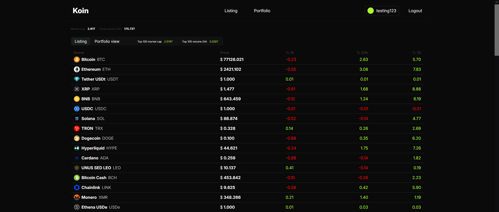

# Crypto Portfolio PHP

Crypto portfolio with live API data built with PHP and MySQL

## Tech Stack
PHP · MySQL

## Features
- Live coin data from CoinMarketCap
- User authentication
- Personal portfolio tracking



# Database
Import `crypto.sql` to set up the database structure:
```bash
mysql -u root -p your_database_name < crypto.sql
```
## Installation
Install dependencies via Composer:
```bash
composer install
```

## API
Get free API key for [Coinmarketcap API](https://coinmarketcap.com/api/)